# Agent config structure

A relationship map of the agent configuration: which **top-level rules**
(always loaded — no `paths:` frontmatter) invoke or reference which
**skills**, **hooks**, and built-in **commands**, and how those in turn
reference each other — "boxes (mostly) all the way down."

**This is a human-facing reference doc, not an instruction file.** It is not
auto-loaded into the agent context (only `CLAUDE.md` and rules with the right
frontmatter are). It is **hand-maintained** and *will* drift as rules/skills
change — regenerating it from the sources is a candidate for its own
skill/script later.

## How to read it

- **Box colour** = kind: blue = rule, green = skill, red = hook,
  purple = built-in command.
- **Solid arrow** (`A --> B`) = A *invokes / composes / delegates to* B (an
  orchestration edge).
- **Dashed arrow** (`A -.-> B`) = A *names / references / see-also* B (a
  weaker pointer), incl. top-level rules cross-referencing each other.
- Edges were extracted from the rule/skill sources (mentions of skill names,
  hook files, and `/commands`), then pruned to the meaningful ones.

Leaf skills with no orchestration edges are omitted for clarity:
`frontend-design` (standalone). Tool rules (the ~40 with `paths:`
frontmatter — `bash.md`, `dependabot.md`, `markdownlint.md`, …) are the
detection-activated reference layer and are not drawn here; the diagram is
about the always-on orchestration spine.

## Mermaid version (GitHub's renderer)

Per GitHub's docs, render this `info` block to see the Mermaid version the
GitHub renderer currently uses — handy when a diagram renders on
mermaid.live but not here (a version mismatch):

```mermaid
  info
```

## Diagram

```mermaid
flowchart TD
  classDef rule fill:#dbeafe,stroke:#3b82f6,color:#1e3a8a;
  classDef skill fill:#dcfce7,stroke:#22c55e,color:#14532d;
  classDef hook fill:#fee2e2,stroke:#ef4444,color:#7f1d1d;
  classDef cmd fill:#ede9fe,stroke:#8b5cf6,color:#4c1d95;

  subgraph RULES["Top-level rules - always loaded"]
    CLAUDE["CLAUDE.md - root agent spec: precedence, scope, when to add rules/skills"]
    QA["qa.md - takes a change from written to release-ready"]
    GIT["git.md - commits, branches, protection, versioning + tags"]
    GH["gh.md - GitHub CLI: PRs, auth fallback, issue triage"]
    TEST["testing.md - the test bar + be-idiomatic-per-language"]
    DOC["documentation.md - the doc bar + right-form-per-audience"]
    STYLE["code-style.md - naming, wrapping, Rule of Three, separators"]
    TROUBLE["troubleshooting.md - reproduce, root cause, regression test"]
  end

  subgraph ORCH["Orchestration skills"]
    QACHECK["qa-check - runs the full QA pipeline"]
    SHIP["ship-pr - commit, push, PR, CI, merge, tag, cleanup"]
    SEC["security-scan - SAST + dependency/supply-chain"]
    CONT["containerize - author/harden/scan Docker images, trivy + hadolint"]
    DEPS["deps-update - deliberate dependency-update sweep"]
    DEBUG["debug-assistant - structured debugging session"]
    RELEASE["release-tag - cut a release tag at the merge commit"]
    WORKTREE["git-worktree-workflow - worktrees: issues, sync, PR prep, cleanup"]
    WRITEDOC["write-documentation - author/refresh a doc to the bar"]
    ADR["adr - record an Architecture Decision Record"]
    AUDIT["claude-audit - audit the Claude Code setup"]
    MODERN["modernize - phased legacy migration roadmap"]
    BATS["bats-setup - scaffold bats testing into a repo"]
    PLAN["plan-review - review a plan before building"]
  end

  subgraph REVIEW["Review skills - qa.md dimensions"]
    ARCH["arch-review - codebase architecture/health"]
    TESTREV["test-review - test-suite quality/coverage"]
    A11Y["a11y-review - accessibility, WCAG"]
    PERF["perf-review - runtime performance, measure-first"]
    PYT["pytest-patterns - pytest depth"]
    TYP["typing-patterns - Python typing depth"]
  end

  subgraph DOMAIN["Domain depth - companions to tool rules"]
    FASTAPI["fastapi-patterns"]
    SQLA["sqlalchemy-patterns"]
    SPOTP["spotify-patterns"]
    SPOTA["spotify-audit"]
  end

  subgraph HOOKS["Hooks"]
    MF["merge-finalization.py - PreToolUse: block merge if completed checklist items remain"]
    RC["rule-coverage.py - PostToolUse: flag deps/langs with no rule"]
  end

  subgraph CMDS["Built-in commands"]
    CR["/code-review"]
    SR["/security-review"]
    SI["/simplify"]
  end

  %% rule -> skills/hooks/commands
  CLAUDE -.-> RC
  CLAUDE -.-> CR
  CLAUDE -.-> SR
  CLAUDE -.-> SI
  QA --> QACHECK
  QA --> SEC
  QA --> CONT
  QA --> DEPS
  QA --> ARCH
  QA --> TESTREV
  QA --> A11Y
  QA --> PERF
  QA --> PYT
  QA --> TYP
  QA --> WRITEDOC
  QA --> ADR
  QA -.-> CR
  QA -.-> SI
  GIT --> WORKTREE
  GIT --> RELEASE
  GIT --> SHIP
  GH --> WORKTREE
  DOC --> WRITEDOC
  DOC --> ADR
  STYLE --> ADR
  TROUBLE --> DEBUG
  TROUBLE --> QACHECK

  %% rule <-> rule (cluster cohesion)
  QA -.-> STYLE
  QA -.-> TEST
  QA -.-> DOC
  DOC -.-> STYLE
  TROUBLE -.-> TEST
  GH -.-> GIT

  %% skill -> skill/hook/command
  QACHECK --> SEC
  QACHECK --> CONT
  QACHECK --> ARCH
  QACHECK --> TESTREV
  QACHECK --> A11Y
  QACHECK --> PERF
  QACHECK --> PYT
  QACHECK --> TYP
  QACHECK -.-> CR
  QACHECK -.-> SI
  QACHECK -.-> SR
  SHIP --> QACHECK
  SHIP --> RELEASE
  SHIP --> WORKTREE
  SHIP --> MF
  SEC --> CONT
  DEPS --> SEC
  DEPS --> QACHECK
  DEPS --> DEBUG
  DEBUG --> QACHECK
  MODERN --> ARCH
  PERF --> ARCH
  TESTREV --> QACHECK
  TESTREV --> BATS
  WRITEDOC --> ADR
  WRITEDOC -.-> PLAN
  PLAN -.-> CR
  AUDIT --> QACHECK
  AUDIT --> SHIP
  RELEASE -.-> SHIP

  %% domain depth (loose)
  PYT -.-> BATS
  PYT -.-> SQLA
  SQLA -.-> FASTAPI
  FASTAPI -.-> QACHECK
  SPOTP -.-> SPOTA

  class CLAUDE,QA,GIT,GH,TEST,DOC,STYLE,TROUBLE rule
  class QACHECK,SHIP,SEC,CONT,DEPS,DEBUG,RELEASE,WORKTREE,WRITEDOC,ADR,AUDIT,MODERN,BATS,PLAN skill
  class ARCH,TESTREV,A11Y,PERF,PYT,TYP,FASTAPI,SQLA,SPOTP,SPOTA skill
  class MF,RC hook
  class CR,SR,SI cmd
```



## Reading the spine

- **`qa.md` is the hub** — it fans out to the whole QA surface (`qa-check`
  as its forcing function, plus the dimension review skills and the
  security/container/deps skills).
- **`qa-check`** is the runtime that actually composes the review skills and
  `security-scan` / `containerize`.
- **`ship-pr`** is the landing pipeline: it calls `qa-check` (local gate),
  `git-worktree-workflow` (prep), `release-tag` (Step 6), and is backstopped
  by the `merge-finalization.py` hook.
- **`git.md` / `gh.md`** point at the git/PR skills (`git-worktree-workflow`,
  `release-tag`, `ship-pr`).
- **`CLAUDE.md`** is the meta-layer: it governs *when* new rules/skills get
  created and is backstopped by the `rule-coverage.py` hook.
